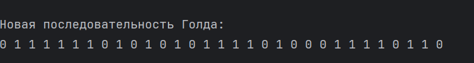
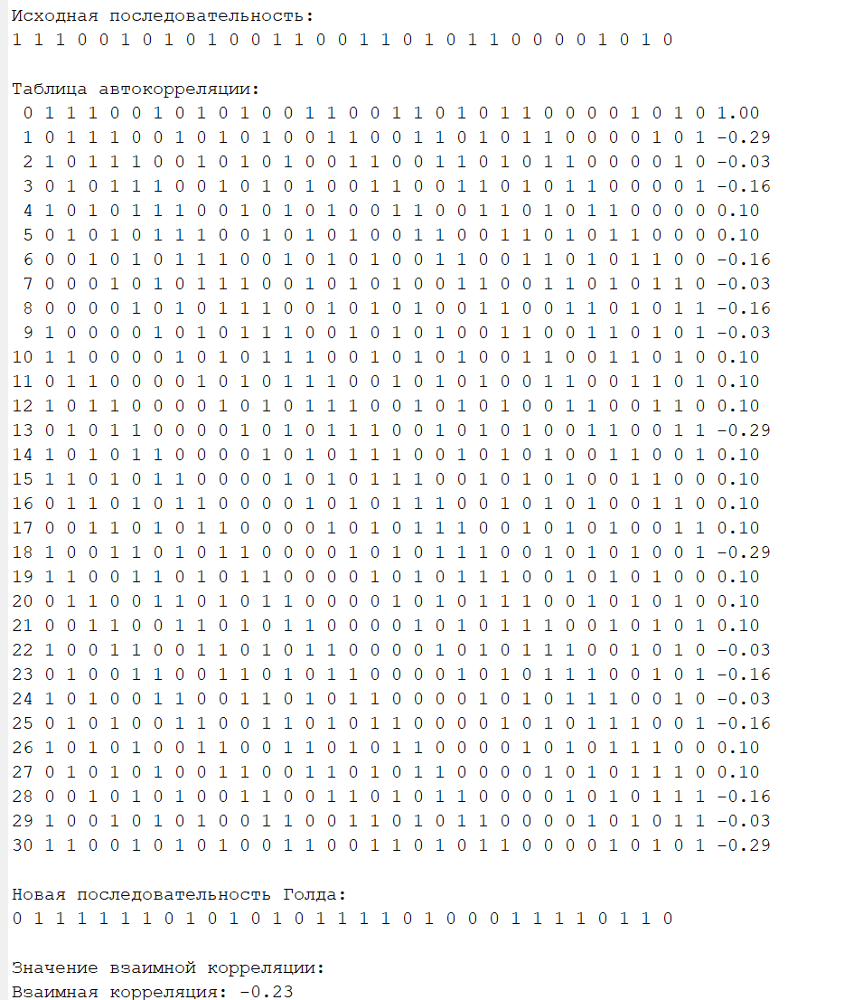
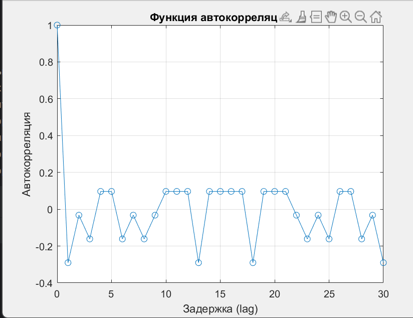

Федеральное агентство связи
Федеральное государственное бюджетное образовательное учреждение
высшего образования
«Сибирский государственный университет телекоммуникаций и информатики» (СибГУТИ)

Отчет
по лабораторной работе №4
по дисциплине «Основы систем мобильной связи»
Тема: «Изучение корреляционных свойств
последовательностей, используемых для синхронизации в сетях мобильной
связи»

Вариант 5

Выполнил:
студент гр. ИА-232
Гурачевский Никита
GitHub:

Цель работы
Получить представление о том, какие существуют псевдослучайные двоичные последовательности, какими корреляционными свойствами они обладают и как используются для синхронизации приемников и передатчиков в сетях мобильной связи.
Теоретические сведенья

Выведите получившуюся последовательность на экран.

Сделайте поэлементный циклический сдвиг последовательности и посчитайте автокорреляцию исходной последовательности и сдвинутой. Сформируйте таблицу с битовыми значениями последовательностей, в последнем столбце которой будет вычисленное значение автокорреляции, как показано в примере ниже.

Сформируйте еще одну последовательность Голда, используя свою схему (рис.4.4 или 4.5), такую что x=x+1, а y= у-5.

Вычислите значение взаимной корреляции исходной и новой последовательностей и выведите в терминал.

Проделайте шаги 1-5 в Matlab. Используйте функции xcorr() и autocorr() для вычисления соответствующих корреляций. Сравните результаты, полученные в Matlab и C/C++.

Выведите на график в Matlab функцию автокорреляции в зависимости от величины задержки (lag).

Контрольные вопросы
1) Для чего в мобильных сетях могут использоваться псевдослучайные последовательности?
   В мобильных сетях псевдослучайные последовательности (PN sequences) применяются для кодирования и модуляции, позволяя выделить индивидуальные сигналы в условиях многопользовательской среды. Например, PN-последовательности широко используются в CDMA (Code Division Multiple Access), чтобы различать пользователей на одной и той же частоте. Они также применяются для спектрального расширения сигнала (spread spectrum), подавления помех и улучшения помехоустойчивости, поскольку позволяют снижать уровень взаимной интерференции между абонентами и базовыми станциями. Это достигается за счёт orthogonality, когда разные сигналы используют уникальные PN-последовательности с минимальной взаимной корреляцией.
2) Что значит положительная корреляция сигналов?
   Положительная корреляция (positive correlation) означает, что две сигнальные последовательности имеют схожий характер или структуру, и при наложении их корреляционная функция даст положительный пик. Это важное свойство в мобильной связи, так как помогает определить, совпадают ли две последовательности. В контексте CDMA-сетей положительная корреляция позволяет приёмнику различать «свой» сигнал от шума и других сигналов, предоставляя возможность «узнавания» сигнала и его декодирования.
3) Что такое корреляционный приём сигналов?
   Корреляционный приём сигналов (correlation receiver) — это метод приёма, который использует свойство корреляции для выделения полезного сигнала из шума. Он измеряет уровень совпадения между принятым сигналом и опорной последовательностью. В мобильных сетях этот метод особенно полезен для устранения помех и многолучевых искажений. Matched filter (согласованный фильтр) и RAKE receiver (приёмник RAKE) — это два распространённых примера корреляционных приёмников, которые активно применяются для декодирования CDMA-сигналов.
4) Как вычисление корреляционных функций помогает синхронизироваться приемникам и передатчику в сетях мобильной связи?
   Корреляционные функции используются для поиска максимума совпадений между принятым и опорным сигналом, что помогает выявить задержку в сигнале и устранить её. Это позволяет приёмнику синхронизироваться с передатчиком, компенсируя time delay и улучшая точность передачи данных. В CDMA и LTE сетях вычисление корреляционной функции помогает синхронизировать устройства по chip timing, обеспечивая точное временное выравнивание сигналов и, как следствие, повышенную устойчивость к интерференции и уменьшение вероятности ошибок.
5) Какими свойствами обладают псевдослучайные последовательности?
   Псевдослучайные последовательности обладают рядом свойств, полезных для мобильной связи:
   Детерминированность: несмотря на кажущуюся случайность, такие последовательности можно воспроизвести в любом приёмнике при известном начальном значении, что упрощает синхронизацию.
   Длинный период: PN-последовательности имеют большой период перед повторением, что улучшает устойчивость к помехам и делает их более «случайными» для наблюдателя.
   Низкая автокорреляция: на любом участке последовательности значение автокорреляции близко к нулю, что минимизирует самоинтерференцию.
   Минимальная кросс-корреляция: различные PN-последовательности имеют минимальную корреляцию между собой, что позволяет выделить сигналы пользователей в CDMA-системах.
6) Какие разновидности PN-последовательностей вам известны?
   Существует несколько основных типов PN-последовательностей, применяемых в мобильных сетях:
   M-последовательности (Maximum-length sequences): это линейные последовательности с максимальным возможным периодом для заданного порядка. Применяются в CDMA и GPS.
   Gold sequences: комбинация двух M-последовательностей, обладающая улучшенными корреляционными свойствами. Их используют в UMTS (Universal Mobile Telecommunications System) для различия пользователей.
   Kasami sequences: имеют более низкую корреляцию, чем M-последовательности, и используются в многоканальных системах связи для повышения устойчивости.
   Чебышёвские последовательности и последовательности Баркера: используются для радарных систем и обеспечивают хорошую корреляционную способность, хотя в мобильных сетях применяются редко.
